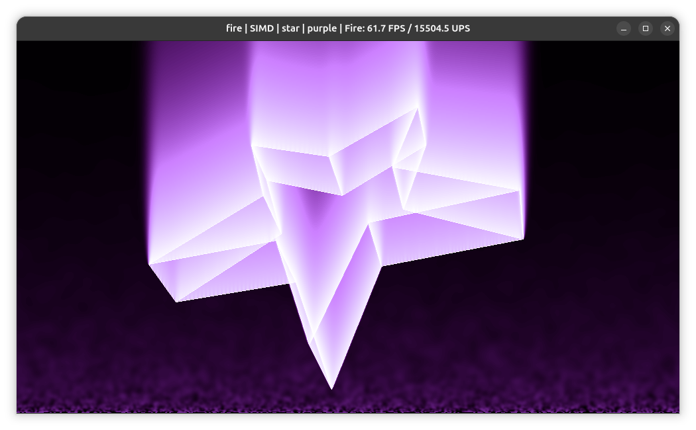
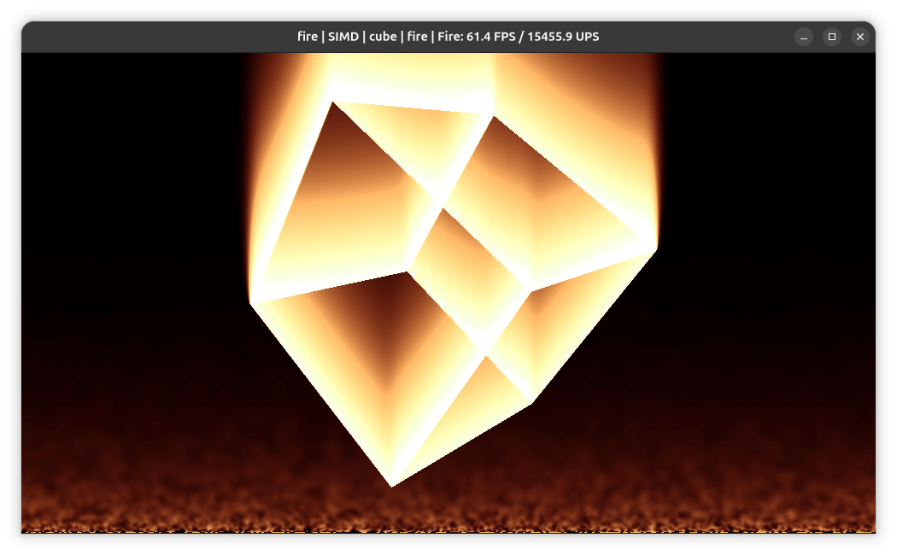
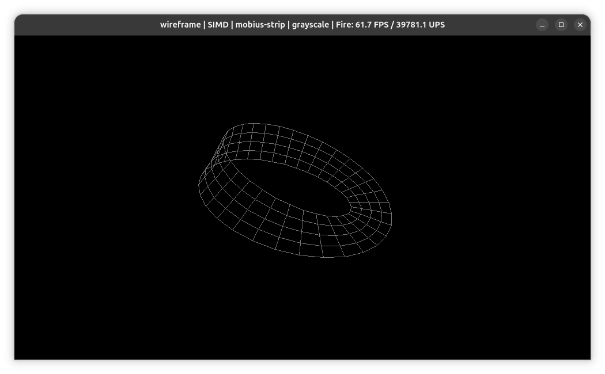

# OldSkool Fire Effect

A Java-based demo featuring a classic fire effect and 3D wireframe shapes.
Originally written as a standalone AWT application in 2011, recently revived and modernized.

## YouTube
[](https://youtu.be/kQdEABACKdA)

## Screenshots



## Requirements

- JDK 21 or higher
- Maven 3.x

## Building the Project

To compile the project and generate the executable JAR:

```bash
mvn clean install
```

## Running the Application

Using Maven (recommended - automatically adds the required `--add-modules jdk.incubator.vector` JVM flag):

```bash
mvn compile exec:exec
```

With arguments:

```bash
mvn compile exec:exec -Dexec.args="--palette evil --shape torus"
```

Or directly from the JAR (requires manual JVM flag):

```bash
java --add-modules jdk.incubator.vector -jar target/oldskoolfire-1.0-SNAPSHOT.jar
```

## Command Line Options

```bash
java -jar target/oldskoolfire-1.0-SNAPSHOT.jar [OPTIONS]
```

### Display Settings

| Option               | Default | Description              |
|:---------------------|:--------|:-------------------------|
| `-W`, `--width`      | 1000    | Initial window width     |
| `-H`, `--height`     | 600     | Initial window height    |
| `-f`, `--fullscreen` | false   | Start in fullscreen mode |

### Visual Settings

| Option            | Default | Description                                |
|:------------------|:--------|:-------------------------------------------|
| `-p`, `--palette` | fire    | Initial palette: `fire`, `evil`, `rockbox` |
| `-s`, `--shape`   | cube    | Initial 3D shape name                      |
| `-c`, `--cooling` | 3       | Fire cooling factor (affects flame height) |

### External Meshes

| Option         | Default | Description                                                 |
|:---------------|:--------|:------------------------------------------------------------|
| `-m`, `--mesh` | -       | Load external OBJ file(s). Can be specified multiple times. |

### Animation Settings

| Option              | Default | Description                      |
|:--------------------|:--------|:---------------------------------|
| `--auto-rotate`     | true    | Start with auto-rotation enabled |
| `--auto-switch`     | false   | Enable automatic scene switching |
| `--switch-interval` | 3000    | Time between scene switches (ms) |
| `--paused`          | false   | Start in paused state            |

### Fire Effect Settings

| Option         | Default | Description                           |
|:---------------|:--------|:--------------------------------------|
| `--still-fire` | false   | Use fixed intensity fire (no flicker) |

### Performance Settings

| Option            | Default | Description                                                                   |
|:------------------|:--------|:------------------------------------------------------------------------------|
| `--gpu`           | false   | Enable GPU-accelerated convolution via TornadoVM (requires TornadoVM runtime) |
| `--no-vector-api` | false   | Disable SIMD Vector API for convolution (use scalar fallback)                 |

### Renderer Settings

| Option              | Default | Description                              |
|:--------------------|:--------|:-----------------------------------------|
| `-w`, `--wireframe` | false   | Start in wireframe mode (no fire effect) |

### Utility Options

| Option            | Description       |
|:------------------|:------------------|
| `--help`          | Show usage help   |
| `-V`, `--version` | Show version info |

### GPU Acceleration (TornadoVM)

The `--gpu` flag offloads fire convolution to the GPU via [TornadoVM](https://www.tornadovm.org/).
Requires GraalVM JDK 21 and a TornadoVM 3.0.0 installation. Use the `tornado` launcher:

```bash
tornado -cp target/oldskoolfire-1.0-SNAPSHOT.jar \
        org.kevinferrare.oldskoolfire.Main \
        --params="--gpu"

```

If the TornadoVM runtime is unavailable or no compatible GPU is detected, the application falls back to CPU-based
convolution automatically.

## Controls

The application is interactive. Use the following keys and mouse actions:

| Action                  | Control                                    |
|:------------------------|:-------------------------------------------|
| **Exit**                | `ESC` or `Q`                               |
| **Change Palette**      | Mouse Wheel or Arrow Up/Down               |
| **Change 3D Shape**     | Mouse Left/Right Click or Arrow Left/Right |
| **Rotate Shape**        | Mouse Drag                                 |
| **Scale Shape**         | Numpad `+` / `-`                           |
| **Z-Axis Movement**     | Numpad `*` / `/`                           |
| **Toggle Auto-Rotate**  | `R`                                        |
| **Toggle Renderer**     | `W`                                        |
| **Toggle Pixel Effect** | `C`                                        |
| **Toggle Fire Source**  | `B`                                        |
| **Adjust Cooling**      | `Page Up` / `Page Down`                    |
| **Pause/Resume**        | `SPACE`                                    |
| **Auto Scene Switch**   | `CTRL`                                     |

## License

Copyright 2011 Kevin Ferrare. Licensed under the Apache License, Version 2.0. See [LICENSE](LICENSE)
and [NOTICE](NOTICE) for details.
